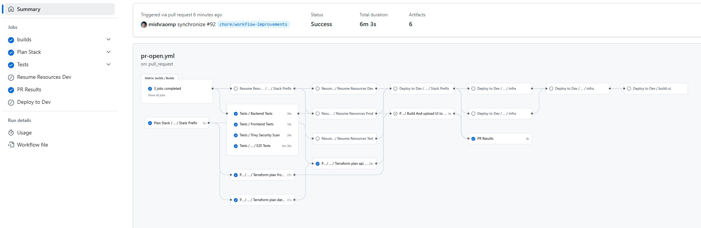
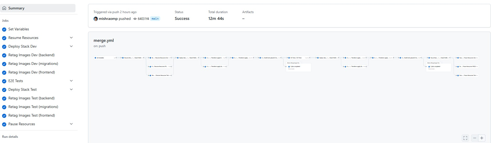

[](https://github.com/bcgov/quickstart-aws-serverless/actions/workflows/merge.yml)
[](https://github.com/bcgov/quickstart-aws-serverless/actions/workflows/pr-open.yml)
[](https://github.com/bcgov/quickstart-aws-serverless/actions/workflows/pr-validate.yml)
[](https://github.com/bcgov/quickstart-aws-serverless/actions/workflows/github-code-scanning/codeql)
[](https://github.com/bcgov/quickstart-aws-serverless/actions/workflows/pause-resources.yml)
[](https://github.com/bcgov/quickstart-aws-serverless/actions/workflows/resume-resources.yml)
# Quickstart for AWS using DynamoDB, ECS Fargate, and CloudFront

This template repository provides a ready-to-deploy containerized application stack for AWS, developed by BC Government. It includes a complete application architecture with:

- **DynamoDB** NoSQL database with pay-per-request billing
- **ECS Fargate** with mixed FARGATE/FARGATE_SPOT capacity providers for cost-optimized backend services
- **API Gateway** with VPC link integration for secure backend access
- **CloudFront** for frontend content delivery with WAF protection
- **NestJS** TypeScript backend API with AWS SDK for DynamoDB
- **React** with Vite for the frontend application
- **Terragrunt/Terraform** for infrastructure-as-code deployment
- **GitHub Actions** for CI/CD pipeline automation

Use this repository as a starting point to quickly deploy a modern, scalable web application on AWS infrastructure.

## Prerequisites

- BCGOV AWS account with appropriate permissions
- AWS CLI installed and configured (for direct AWS account interaction)
- Docker/Podman installed (for local development with containers)
- Node.js 22+ and npm installed (for local development without containers)
- Terraform CLI and Terragrunt (for infrastructure deployment)


# Folder Structure
```
/quickstart-aws-serverless
├── .github/                   # GitHub workflows and actions for CI/CD
│   └── workflows/             # GitHub Actions workflow definitions
├── terraform/                 # Terragrunt configuration files for environment management
│   ├── api/                   # API environment-specific configurations (dev, test)
│   ├── database/              # Database environment-specific configurations (dev, test)
│   └── frontend/              # Frontend environment-specific configurations (dev, test)
├── infrastructure/            # Terraform code for each AWS infrastructure component
│   ├── api/                   # ECS Fargate API configuration (ALB, API Gateway, autoscaling)
│   ├── frontend/              # CloudFront with WAF configuration
│   ├── modules/               # Common Terraform Modules
|   └── database/              # DynamoDB table configuration
├── backend/                   # NestJS backend API code
│   ├── src/                   # Source code with controllers, services, and modules
│   └── Dockerfile             # Container definition for backend service
├── frontend/                  # Vite + React SPA
│   ├── src/                   # React components, routes, and services
│   ├── e2e/                   # End-to-end tests using Playwright
│   └── Dockerfile             # Container definition for frontend service
├── tests/                     # Test suites beyond component-level tests
│   ├── integration/           # Integration tests across services
│   └── load/                  # Load testing scripts for performance testing
├── docker-compose.yml         # Local development environment definition
├── README.md                  # Project documentation
└── package.json               # Node.js monorepo for shared configurations
```

## Repository Structure Explained

- **.github/**: Contains GitHub workflow definitions and actions for the CI/CD pipeline.
  - **workflows/**: GitHub Actions workflow files that handle automated testing, deployment, and resource management.

- **terraform/**: Contains Terragrunt configuration files that orchestrate the infrastructure deployment.
  - Environment-specific folders (`dev`, `test`) contain configurations for different deployment stages.
  - Uses the infrastructure modules defined in the infrastructure directory.

- **infrastructure/**: Contains Terraform modules for each AWS component.
  - **api/**: Defines infrastructure for the backend API:
    - ECS Fargate cluster with mixed FARGATE/FARGATE_SPOT capacity providers
    - Application Load Balancer with internal/external listeners
    - API Gateway with VPC link for secure backend access
    - Auto-scaling policies based on CPU/memory utilization
    - Flyway migration task execution for database schema management
    - IAM roles and security group configurations
    - AWS Secrets Manager integration for database credentials
  - **frontend/**: Sets up CloudFront distribution with WAF rules for content delivery.  
  - **database/**: Configures DynamoDB table with proper indexes and settings.
  - **modules/**: Reusable Terraform code shared across frontend, api

- **backend/**: NestJS backend application with TypeScript.
  - **src/**: Application code organized by feature modules.
  - Includes AWS SDK integration for DynamoDB operations.

- **frontend/**: React-based single-page application built with Vite.
  - **src/**: React components and application logic.
  - **e2e/**: End-to-end tests with Playwright for UI validation.
  - Includes deployment configuration for AWS.

- **tests/**: Cross-component test suites to validate the application at a higher level.
  - **integration/**: Tests validating interactions between services.
  - **load/**: Performance testing scripts to ensure scalability.

- **docker-compose.yml**: Defines the local development environment with all services.

- **package.json**: Monorepo configuration for shared tooling like ESLint and Prettier.

# Running Locally
## Running Locally with Docker Compose

To run the entire stack locally using the `docker-compose.yml` file in the root directory, follow these steps:

1. Ensure Docker (or Podman) is installed and running on your machine.
2. Navigate to the root directory of the project:
    ```sh
    cd <checkedout_repo_dir>
    ```
3. Build and start the containers:
    ```sh
    docker-compose up --build
    ```
4. The backend API should now be running at `http://localhost:3001` and the frontend at `http://localhost:3000`.

To stop the containers, press `Ctrl+C` in the terminal where `docker-compose` is running, or run:
```sh
docker-compose down
```
## Running Locally without Docker (Complex)
Prerequisites:

  1. Install Node.js 22 and above.
  2. Install AWS CLI and configure with credentials for DynamoDB Local.
  3. Install DynamoDB Local for development.

Once all the software is installed follow below steps.

1. Start DynamoDB Local:
```sh
# Download and run DynamoDB Local
java -Djava.library.path=./DynamoDBLocal_lib -jar DynamoDBLocal.jar -sharedDb -inMemory
```

2. Create the local table and add sample data:
```sh
# Create table
aws dynamodb create-table \
  --endpoint-url http://localhost:8000 \
  --table-name users \
  --attribute-definitions AttributeName=id,AttributeType=S AttributeName=email,AttributeType=S \
  --key-schema AttributeName=id,KeyType=HASH \
  --global-secondary-indexes IndexName=EmailIndex,KeySchema=[{AttributeName=email,KeyType=HASH}],Projection={ProjectionType=ALL} \
  --billing-mode PAY_PER_REQUEST

# Add sample data
aws dynamodb put-item \
  --endpoint-url http://localhost:8000 \
  --table-name users \
  --item '{"id":{"S":"1"}, "name":{"S":"John"}, "email":{"S":"John.ipsum@test.com"}}'
```

3. Run backend from root of folder:
```sh
cd backend
export DYNAMODB_TABLE_NAME=users
export DYNAMODB_ENDPOINT=http://localhost:8000
export AWS_REGION=ca-central-1
export AWS_ACCESS_KEY_ID=dummy
export AWS_SECRET_ACCESS_KEY=dummy
npm run start:dev
```

4. Run Frontend from root of folder:
```sh
cd frontend
npm run dev
```

# Deploying to AWS

This repository uses a Terraform/Terragrunt approach for deploying to AWS, with automated workflows through GitHub Actions.

## Deployment Using GitHub Actions CI/CD Pipeline

The repository includes pre-configured GitHub Actions workflows that handle:
- Building and testing changes on pull requests
- Deploying to AWS environments on merge to specific branches
- Resource management (pausing/resuming)
- Automated testing including unit tests, integration tests, and load tests
- Security scanning with Trivy

To use the CI/CD pipeline:

1. Clone this repository
2. Follow the deployment instructions, refer to the [AWS deployment setup guide](./AWS-DEPLOY.md).

# CI/CD Workflows

This repository includes sophisticated GitHub Actions workflows for continuous integration and deployment.

## Pull Request Workflow


When a pull request is opened:
1. Code is built with concurrency control to prevent overlapping operations
2. Infrastructure changes are planned with Terraform/Terragrunt
3. Comprehensive tests are run in isolated environments with concurrency control
4. Security scans are performed with Trivy for vulnerability detection
5. SonarCloud analysis runs for both frontend and backend code quality
6. A review environment can be created manually via workflow dispatch

## Merge Workflow


When code is merged to the main branch:
1. AWS resources are automatically resumed across all environments
2. The application is deployed to the dev environment
3. Container images are tagged with the 'dev' tag
4. End-to-end tests verify functionality against the dev environment
5. Upon successful testing, deployment progresses to the test environment
6. Container images are tagged with the 'test' tag
7. AWS resources are paused after deployment to optimize costs

## GitHub Actions Workflows Overview

The repository includes a comprehensive set of GitHub Actions workflows that automate the entire development lifecycle. These workflows are organized into three categories:

### Main Workflows
- **PR Workflows**: Triggered when pull requests are opened, updated, or closed
  - `pr-open.yml`: Builds containers with concurrency control, runs tests, and provides validation for new PRs
  - `pr-validate.yml`: Ensures code quality and standards compliance
  - `pr-close.yml`: Cleans up resources when PRs are closed
- **Deployment Workflows**: Handle the deployment pipeline
  - `merge.yml`: Resumes resources, deploys to dev and test environments, and then pauses resources
  - `release.yml`: Creates releases and deploys to production (manually triggered)

### Composite Workflows
- **Building**: `.builds.yml` 
- **Testing**: `.tests.yml`, `.e2e.yml`, `.load-test.yml`
- **Deployment**: `.deploy_stack.yml`, `.destroy_stack.yml`, `.deployer.yml`, `.stack-prefix.yml`

### Resource Management
- **Cost Optimization**: 
  - `pause-resources.yml`: Pauses ECS services in specified environments (dev/test/prod) either on schedule, manually, or automatically after deployment. Note: DynamoDB doesn't require pausing as it uses pay-per-request billing.
  - `resume-resources.yml`: Resumes ECS services in specified environments either on schedule, manually, or automatically before deployment
- **Workflow Integration**:
  - Resources are automatically resumed before deployments in the merge workflow
  - Resources are automatically paused after successful deployments to save costs
  - Individual environment targeting allows for selective resource management
- **Cleanup**: `prune-env.yml`

For detailed documentation on all GitHub Actions workflows, including their triggers, purposes, steps, and outputs, see the [GitHub Actions Workflows Guide](./GHA.md).

## Architecture


### Infrastructure Components

#### ECS Fargate Configuration
- **Mixed Capacity Strategy**: Uses both FARGATE (20% weight with base=1) and FARGATE_SPOT (80% weight) for cost optimization
- **Auto-Scaling**: Configures automatic scaling based on CPU and memory utilization:
  - Scales up aggressively (by 2 instances) when thresholds are exceeded
  - Scales down conservatively (by 1 instance) when resources are underutilized
- **Task Definitions**:
  - Flyway migration task that runs before application deployment
  - Backend API task with PostgreSQL environment variables
- **Secrets Management**: Securely retrieves database credentials from AWS Secrets Manager

#### API Gateway
- HTTP API Gateway with VPC Link integration
- Routes all traffic to the internal Application Load Balancer
- Supports ANY method with proxy path integration

#### Database Integration
- Automatically connects to DynamoDB using the AWS SDK
- Uses pay-per-request billing model for cost efficiency
- Supports both local development with DynamoDB Local and production deployment
- No migration scripts needed - DynamoDB tables are created via Terraform

# Customizing the Template

To adapt this template for your own project:

1. **Repository Setup**
   - Clone this repository
   - Update project names in package.json files
   - Set up required GitHub secrets

2. **Infrastructure Customization**
   - Modify `terraform` and `infrastructure` directories to adjust resource configurations
   - Update environment-specific variables for your needs
   - Adjust ECS task definitions in `infrastructure/api/ecs.tf`:
     - Customize container resources (CPU/memory) based on your application needs
     - Modify auto-scaling thresholds in `infrastructure/api/autoscaling.tf`
     - Update capacity provider strategy for cost-optimization vs. reliability balance
   - Configure database connection parameters and schema information
   - Customize API Gateway and VPC link settings in `infrastructure/api/api-gateway.tf`

3. **Application Customization**
   - Customize the NestJS backend in the `backend` directory
   - Adapt the React frontend in the `frontend` directory
   - Update database schema and migrations in `migrations/sql`

4. **CI/CD Pipeline Adjustments**
   - Modify GitHub workflows in `.github/workflows` as needed
   - Update deployment configuration to match your AWS account structure
   - Configure resource management workflows (pause/resume) to match your schedule:
     - Adjust cron schedules for automatic pausing/resuming based on your working hours
     - Set up environment-specific resource management for cost optimization
     - Customize protection rules for production environments

5. **Testing**
   - Adapt existing tests to match your application logic in each component:
     - Backend unit tests using Vitest in the `backend/src` directory
     - Frontend unit tests in the `frontend/src/__tests__` directory
     - End-to-end tests using Playwright in the `frontend/e2e` directory
     - Load tests using k6 in the `tests/load` directory
   - Configure SonarCloud for code quality analysis by updating the project keys
   - Adjust GitHub workflow test runners as needed for your specific environments

# Contributing

Contributions to this quickstart template are welcome! Please see our [CONTRIBUTING.md](CONTRIBUTING.md) file for details on how to contribute.
